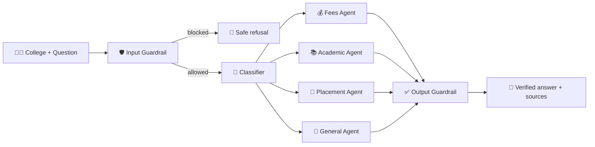

# 🎓 Student Mate — AI College Assistant

> Enter a college name and a question. Get a verified answer on **fees, academics, placements or campus life** — without opening a single college website.


<!-- Add a screenshot of the app:  -->

## 💡 The Problem

Choosing a college means digging through many websites for **placement records, fee structures, academic rules** and **campus life** (sports, events, activities). Every college organises this information differently, so comparing them is slow and frustrating.

## ✅ The Solution

**Student Mate** is a multi-agent AI system. The student gives only:

1. 🏫 the **college name**
2. ❓ the **question** (optionally the semester)

Specialist agents search the live web, read the top pages and write a short, sourced answer. **Two guardrails** check every request and every answer for safety and accuracy.

## ✨ Features

- 💰 **Fees** — tuition, hostel, refunds, late charges
- 📚 **Academic** — attendance, exams, credits, SGPA/CGPA, syllabus
- 💼 **Placement** — packages, top recruiters, placement stats
- 🏫 **General** — sports, events, clubs, infrastructure
- 🧭 **Auto-routing** — a classifier picks the right agent (or choose the topic yourself)
- 🛡️ **Guardrails** — block unsafe or off-topic requests, and remove made-up facts from answers
- 🔗 **Sources** — every answer links to the pages it came from
- 🎨 **Streamlit UI** — live pipeline tracker, chat history, verified badge

## 🧠 How It Works



Each specialist agent: **search (Tavily) → scrape top pages → answer only from what was found**.

## 🛠️ Tech Stack

| Layer | Tools |
|---|---|
| Agents & workflow | LangChain, LangGraph |
| LLM | Mistral Medium 3.5 via OpenRouter |
| Web search & scraping | Tavily, Requests, BeautifulSoup |
| Guardrails | AI Guardrails that checks the input is correct according to my project and output is correct that comes from LLM if wrong it will block  |
| UI | Streamlit |

## 📁 Project Structure

```
student_mate_ai_agent/
├── app.py                        # Streamlit UI
├── config.py                     # API keys + shared LLM
├── graph/graph.py                # LangGraph workflow
├── state/state.py                # shared state
├── agent/
│   ├── input_guardrails_agent.py # checks the request
│   ├── classifier_agent.py       # picks the specialist
│   ├── common.py                 # search → scrape → answer logic
│   ├── fees_agent.py
│   ├── academic_agent.py
│   ├── placement_agent.py
│   ├── general_agent.py
│   └── output_guardrails.py      # verifies the answer
└── tools/web_tool.py             # Tavily search + page scraper
```

## 🚀 Getting Started

```bash
git clone https://github.com/Ankan3579/student_mate_ai_agent.git
cd student_mate_ai_agent

python -m venv .venv
.venv\Scripts\activate          # macOS/Linux: source .venv/bin/activate
pip install -r requirements.txt
```

Create a `.env` file in the project root:

```env
OPENROUTER_API_KEY=your_openrouter_key
TAVILY_API_KEY=your_tavily_key
```

Run the app:

```bash
streamlit run app.py
```

## 💬 Example Questions

- *"What is the minimum attendance required to sit for exams?"*
- *"What is the tuition fee for the 2nd semester?"*
- *"What is the average package and which companies recruit here?"*
- *"What sports and cultural events does the campus have?"*


## ⚠️ Disclaimer

Answers come from live web sources. Always confirm important details (especially fees and dates) with the college.

## 👤 Author

**Ankan** — [@Ankan3579](https://github.com/Ankan3579)

⭐ If this project helps you, give it a star!
